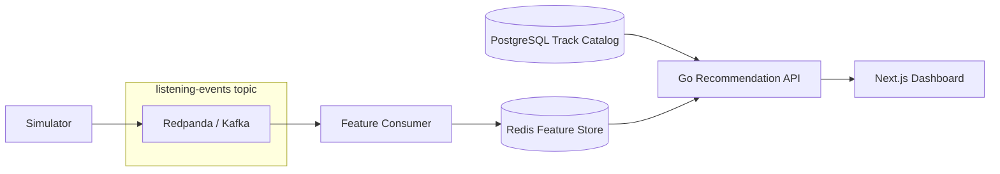

# EchoRec

**EchoRec** is a real-time music recommendation platform built to demonstrate backend engineering, event-driven architecture, and explainable personalization — not a generic CRUD app.

It simulates listening behavior, streams events through Redpanda (Kafka-compatible), updates user preference features in Redis, and serves personalized recommendations from a Go API with a simple Next.js dashboard for demos and interviews.

## Why This Project Exists

Most portfolio projects stop at REST + database. EchoRec is designed to show skills that matter for backend, infrastructure, and recommendation-system roles:

- **Event ingestion** — listening events flow through a streaming layer
- **Feature updates** — user actions continuously shape preference profiles
- **Low-latency serving** — recommendations combine Redis features with a PostgreSQL catalog
- **Experimentation** — stable A/B strategy assignment with basic metrics
- **Observability-ready shape** — clear service boundaries and debuggable data paths

This is a **local MVP**. It does not use the real Spotify API, does not train ML models, and is not deployed to production.

## System Architecture



**Core loop:**

```text
recommend → user action → event ingestion → feature update → better recommendation
```

In this MVP, user actions are generated by a simulator. The consumer turns those events into Redis features that the API reads when serving recommendations.

## Tech Stack

| Layer | Technology |
|-------|------------|
| Backend API | Go |
| Event streaming | Redpanda (Kafka-compatible) |
| Feature store | Redis |
| Track catalog | PostgreSQL |
| Dashboard | Next.js + TypeScript |
| Local dev | Docker Compose |

## How to Run Locally

**Prerequisites:** Docker Desktop (or Docker Engine + Compose)

```bash
docker compose up --build
```

**Dashboard:** [http://localhost:3000](http://localhost:3000)

**API:** [http://localhost:8080](http://localhost:8080)

If PostgreSQL was initialized before the track catalog was added, reset the volume so migrations and seed data run:

```bash
docker compose down -v
docker compose up --build
```

Give the simulator and consumer ~30–60 seconds to populate Redis before checking personalized recommendations.

## API Examples

```bash
curl http://localhost:8080/health
curl "http://localhost:8080/tracks?limit=5"
curl http://localhost:8080/users/user_1/features
curl http://localhost:8080/users/user_1/recommendations
curl http://localhost:8080/experiments/default/metrics
```

**Health:**

```json
{"status":"OK"}
```

**Recommendations** (includes assigned experiment strategy):

```json
{
  "userId": "user_1",
  "strategy": "genre_affinity",
  "recommendations": [
    {
      "trackId": "track_042",
      "title": "Night Drive",
      "artistId": "artist_7",
      "artistName": "The Signals",
      "genre": "indie",
      "score": 0.91,
      "reason": "Strong match with user's indie preference"
    }
  ]
}
```

**Cold-start user** (no Redis features yet):

```bash
curl http://localhost:8080/users/user_99/recommendations
```

## Recommendation Strategy

Recommendations are **rule-based and explainable** — no ML model training.

For each request:

1. Load user genre/artist scores and recent tracks from Redis
2. Load candidate tracks from PostgreSQL (100 seeded tracks)
3. Exclude recently played tracks when enough candidates remain
4. Score each track and return the top N (default 10)

**Scoring signals:**

| Signal | Source |
|--------|--------|
| Genre affinity | Normalized positive score from `user:{userId}:genre_score` |
| Artist affinity | Normalized positive score from `user:{userId}:artist_score` |
| Popularity | `tracks.popularity / 100` |
| Freshness | Normalized `release_year` (2015–2026 catalog range) |

**Cold start:** if a user has no genre or artist scores, recommendations use popularity + freshness only.

Each result includes a short human-readable `reason` based on the strongest signals.

See [DESIGN.md](./DESIGN.md) for full scoring and feature-update details.

## Experimentation Layer

Each user is assigned to one of three strategies via stable hashing (`FNV-1a(userId) % 3`):

| Strategy | Focus |
|----------|-------|
| `genre_affinity` | Higher genre weight (0.55) |
| `artist_affinity` | Higher artist weight (0.45) |
| `exploration` | Higher popularity + freshness (0.35 each) |

Metrics are stored in Redis per strategy:

- `recommendation_requests` — incremented on each recommendation request
- `impressions` — number of tracks returned
- `average_latency_ms` / `p95_latency_ms` — computed from the last 100 latency samples

```bash
curl http://localhost:8080/experiments/default/metrics
```

The same user always receives the same strategy. Different users may land in different groups.

## Verification Commands

**Services and logs:**

```bash
docker compose up --build
docker compose logs -f simulator
docker compose logs -f consumer
```

**Streaming layer:**

```bash
docker compose exec redpanda rpk topic consume listening-events -n 5
```

**Redis features:**

```bash
docker compose exec redis redis-cli HGETALL user:user_1:genre_score
docker compose exec redis redis-cli HGETALL user:user_1:artist_score
docker compose exec redis redis-cli LRANGE user:user_1:recent_tracks 0 -1
docker compose exec redis redis-cli HGETALL user:user_1:event_counts
```

**Compare users after events accumulate:**

```bash
curl http://localhost:8080/users/user_1/recommendations
curl http://localhost:8080/users/user_2/recommendations
```

## Project Structure

```text
Recom/
  api/              Go recommendation API
  consumer/         Kafka consumer → Redis feature updates
  simulator/        Fake listening event producer
  dashboard/        Next.js interview dashboard
  events/           Shared listening event schema
  db/               PostgreSQL migrations + seed data
  docker-compose.yml
  README.md
  DESIGN.md
```

## Current Limitations

- Local Docker Compose only — no cloud deployment
- No authentication or multi-tenant isolation
- No real Spotify (or other) music API integration
- Rule-based scoring only — no ML training or embedding search
- Small catalog (100 tracks) loaded fully into memory per request
- Experiment metrics track requests/latency only — not play/skip/save outcomes yet
- Simulator-generated events, not real user traffic

## Future Improvements

- Track outcome metrics per strategy (skip rate, save rate, replay rate)
- `POST /events` for manual event injection in demos
- Prometheus / Grafana for service and experiment observability
- Candidate retrieval optimizations (indexes, caching, pagination)
- pgvector or embedding-based similarity for larger catalogs
- Authentication and per-user API access
- Kubernetes deployment with separate scaling for API, consumer, and stream processing

## Resume Bullets

- Built EchoRec, a real-time music recommendation platform that ingests listening events through Redpanda/Kafka, updates Redis-based user preference features, and serves personalized recommendations through a Go API with a Next.js dashboard.
- Implemented a feedback loop where user actions such as plays, skips, likes, saves, and replays continuously update genre and artist affinity scores used for recommendation serving.
- Designed an experimentation layer with stable user-to-strategy assignment and Redis-backed metrics for recommendation requests, impressions, average latency, and p95 latency.

## Screenshots

_Add dashboard screenshots here after running the project locally._

Suggested captures:

- System status + architecture panel
- User feature profile for `user_1`
- Recommendations with assigned strategy
- Experiment metrics table

## Further Reading

- [DESIGN.md](./DESIGN.md) — architecture decisions, tradeoffs, and production-scale notes
- [cursor.md](./cursor.md) — original phased development plan

## Verification Note

Documentation was written against the implemented codebase. Full end-to-end verification (`docker compose up`, browser dashboard, live curl against a running stack) requires Docker Desktop to be running locally and was **not confirmed in the documentation authoring environment**.
